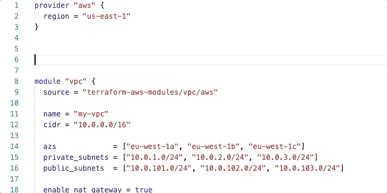

# Terraform-Completer

This extension provides basic autocomplete for Terraform modules. It is a fork of [erd0s' terraform-autocomplete](https://github.com/erd0s/terraform-autocomplete) extension but instead of autocompleting resources, it autocompletes inputs and outputs for modules in addition to updating some of the code to work with Terraform >0.12.

Much like the original Terraform Autocomplete, this extension is **very beta** and may end up becoming obsolete by the time Terraform's official [VS Code extension](https://github.com/hashicorp/vscode-terraform) matures. However, it may help to provide a solution while we wait for more feature-rich autocomplete support in VS Code for Terraform.

### Companion extensions

Pair this extension with the [official Terraform VS Code extension](https://github.com/hashicorp/vscode-terraform) to provide syntax highlighting and some autocomplete for resources.

## Features

The extension for the time being **only works** for modules hosted in the [Terraform registry](https://registry.terraform.io/). There is support for public and private modules by utilizing the APIs provided by Hashicorp. To take advantage of modules hosted in private registries, log in to your account by running `terraform login`. The extension will automatically grab the token saved in the `~/.terraformrc` or `~/.terraform.d/credentials.tfrc.json` file and include in the Authorization headers to the registry API (https://registry.terraform.io or https://app.terraform.io/api/registry).

Autocomplete module inputs

Autocomplete module outputs

Module readme on source hover

Snippet for adding required inputs

## Known Issues

- The extension cannot accurately parse modules with pinned versions or alpha versions with special characters in the version.
- Some modules report optional inputs as required (Registry API reports the required inputs incorrectly).
- Some modules in the registry may not provide any autocompletion (Registry API reports 404 on these modules or we're searching the URL incorrectly.)
- Cannot parse other files in the current directory for more modules.
- Untested in Windows

## Release Notes

See the [changelog](CHANGELOG.md) for more info.
